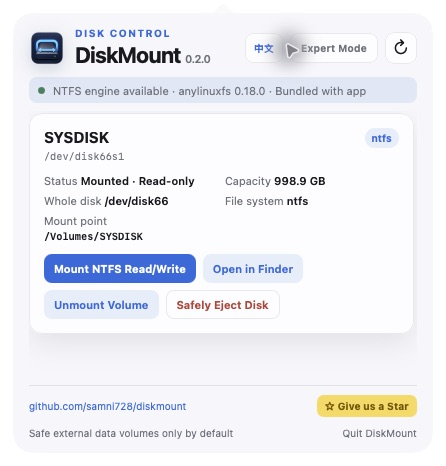
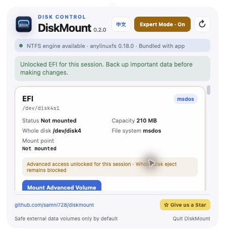

<p align="center">
  
</p>

<p align="center">
  A safe macOS menu bar utility for external disks and NTFS read/write mounting.
</p>

<p align="center">
  <strong>English</strong> · <a href="README.zh-CN.md">简体中文</a>
</p>

<p align="center">
  <a href="https://github.com/samni728/diskmount/releases/latest">Download</a> ·
  <a href="https://github.com/samni728/diskmount/stargazers">Give the project a Star</a>
</p>

# DiskMount

Current version: **0.2.0**

DiskMount detects USB drives and external disks, displays them in a compact menu bar panel, and provides mount, unmount, Finder, and safe-eject actions. NTFS volumes can be remounted with read/write access through the bundled `anylinuxfs` runtime without changing their file-system format.

> [!IMPORTANT]
> DiskMount never formats, erases, repartitions, or converts a disk. “Mount NTFS Read/Write” changes only the active mount method.



## Features

- Native macOS menu bar app with an AppKit lifecycle and WebKit control panel;
- automatic refresh when external volumes are mounted, unmounted, or renamed;
- English and Simplified Chinese UI with a persistent language switch;
- device name, identifier, whole disk, file system, capacity, mount point, and write state;
- regular mount/unmount operations for FAT, exFAT, and APFS data volumes;
- NTFS read/write mounting through bundled `anylinuxfs 0.18.0`;
- open mounted volumes in Finder and safely eject external disks;
- fixed header and footer with an independently scrollable device list;
- project link and Star button inside the app.

## Safe Mode and Expert Mode

Safe Mode is the default. It hides the active macOS boot disk and technical partitions such as EFI, Recovery, Preboot, VM, and Update.

Expert Mode makes advanced volumes visible but does not unlock them automatically. Access requires a second confirmation for each individual volume. An authorized advanced volume can be mounted, opened in Finder, and unmounted for the current app session.

Safety boundaries remain enforced in Swift, not only in the WebUI:

- authorization expires when Expert Mode is closed or the app exits;
- protected whole disks cannot be ejected through Expert Mode;
- DiskMount does not bypass SIP or macOS security policy;
- sealed macOS system volumes are not forced writable;
- no format conversion, erase, or repartition operation exists.



## NTFS authorization fix in 0.2.0

Earlier builds launched `anylinuxfs` directly as root through the macOS authorization dialog. Unlike `sudo`, that mechanism did not provide `SUDO_UID` and `SUDO_GID`, so `anylinuxfs` could not identify the desktop user and rejected the mount.

0.2.0 preserves the macOS administrator prompt while forwarding the invoking user identity expected by `anylinuxfs`. This matches the privilege model of `sudo anylinuxfs ...` without storing or reading the administrator password.

## Requirements

- Apple Silicon Mac: M1, M2, M3, M4, M5, or later;
- macOS 26 or later;
- network access for the first Alpine microVM root-file-system initialization;
- administrator approval when a mount operation requires elevated access.

Intel/x86 Macs are not supported in 0.2.0 because the upstream `anylinuxfs/libkrun` runtime currently targets Apple Silicon.

## Installation

1. Download `DiskMount-0.2.0-macOS26.dmg` from [Releases](https://github.com/samni728/diskmount/releases);
2. open the DMG and drag `DiskMount.app` to `Applications`;
3. launch DiskMount from Applications;
4. use the menu bar item after the initial panel appears.

The DMG bundles the ARM64 `anylinuxfs` executable, Linux kernel, VM helpers, modules, and `libblkid`. End users do not need Homebrew, Xcode, XcodeGen, or a separately installed anylinuxfs package.

The current release uses an Apple Development certificate for project testing. Warning-free public distribution still requires a Developer ID Application certificate, Apple notarization, and stapling.

## Build and test

```bash
cd DiskMount
xcodegen generate
xcodebuild \
  -project DiskMount.xcodeproj \
  -scheme DiskMount \
  -configuration Debug \
  -derivedDataPath build/TestDerived \
  test
```

Build the signed local DMG:

```bash
cd DiskMount
./scripts/build_dmg.sh
```

## Automated Releases

The workflow at `.github/workflows/release.yml` runs on every `v*` tag using GitHub's Apple Silicon `macos-26` runner. It validates the tag against `VERSION`, builds a self-contained DMG, generates a SHA-256 file, and creates a GitHub Release with automatic release notes.

Release sequence:

```bash
# Update VERSION and release notes first
git tag -a v0.2.1 -m "DiskMount 0.2.1"
git push origin main
git push origin v0.2.1
```

Automated packages are ad-hoc signed unless Developer ID signing and notarization secrets are configured. See [RELEASING.md](RELEASING.md) for the maintenance checklist.

## Architecture

```text
Explicit AppKit lifecycle
  └─ Menu bar NSStatusItem
      └─ NSPopover
          └─ WKWebView (HTML/CSS/JavaScript)
              └─ Restricted Swift message bridge
                  ├─ DiskService
                  │   ├─ external-disk discovery
                  │   ├─ boot/APFS System/EFI risk filtering
                  │   └─ /usr/sbin/diskutil
                  └─ AnyLinuxFSService
                      └─ bundled anylinuxfs runtime
```

## Open-source acknowledgements

NTFS read/write support is built on [nohajc/anylinuxfs](https://github.com/nohajc/anylinuxfs), which combines Linux file-system drivers, a [libkrun](https://github.com/containers/libkrun) microVM, and NFS. Thank you to the anylinuxfs author and the contributors to libkrun, libkrunfw, vmnet-helper, gvproxy, docker-nfs-server, and util-linux.

DiskMount invokes an unmodified anylinuxfs executable as a separate process. The distributed app preserves the upstream license, README, SBOM, and util-linux license material. Versions, source links, checksums, and license details are listed in [THIRD_PARTY_NOTICES.md](DiskMount/Resources/THIRD_PARTY_NOTICES.md).

DiskMount is not an official anylinuxfs GUI and is not endorsed by the upstream project.

## Known limitations

- anylinuxfs exposes the mounted volume to macOS as a local NFS network volume;
- Microsoft Word may not directly edit files on this type of network volume;
- long, heavy transfers with the default ntfs-3g driver may occasionally report retryable I/O errors;
- first-time microVM initialization requires network access;
- do not unmount or unplug a device while files are being written.

See [CHANGELOG.md](CHANGELOG.md) for release history.
