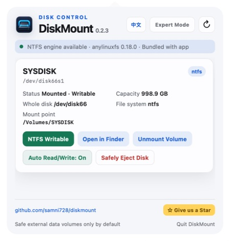
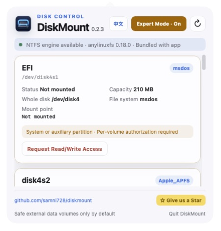

<p align="center">
  
</p>

<p align="center">
  A safe macOS menu bar utility for external disks and NTFS read/write mounting.
</p>

<p align="center">
  <strong>English</strong> · <a href="README.zh-CN.md">简体中文</a>
</p>

<p align="center">
  <a href="https://github.com/samni728/diskmount/releases/latest">Download</a> ·
  <a href="https://github.com/samni728/diskmount/stargazers">Give the project a Star</a>
</p>

<p align="center">
  Support continued development —
  <a href="https://ko-fi.com/samni728">
    
  </a>
  <sub>⌘-click to keep this README open</sub>
</p>

# DiskMount

Current version: **0.2.7**

DiskMount detects USB drives and external disks, displays them in a compact menu bar panel, and provides mount, Finder, and safe-eject actions. NTFS volumes can be remounted with read/write access through the bundled `anylinuxfs` runtime without changing their file-system format. Normal mode exposes one clear eject action; per-volume unmount is reserved for advanced volumes in Expert Mode.

> [!IMPORTANT]
> DiskMount never formats, erases, repartitions, or converts a disk. “Mount NTFS Read/Write” changes only the active mount method.

> [!WARNING]
> **Permissions required for NTFS read/write:**
> 1. Enter an administrator password when DiskMount requests authorization. This authorization is used only for NTFS mounting, stopping its disk service, safe eject, and failure recovery. The password is never stored, logged, or uploaded.
> 2. Enable **DiskMount** under **System Settings → Privacy & Security → Full Disk Access**.
> 3. If macOS shows the option, also enable **System Settings → Privacy & Security → Files & Folders → DiskMount → Removable Volumes**.
> 4. Fully quit and reopen DiskMount after changing either macOS permission.



## Features

- Native macOS menu bar app with an AppKit lifecycle and WebKit control panel;
- automatic refresh when external volumes are mounted, unmounted, or renamed;
- English and Simplified Chinese UI with a persistent language switch;
- device name, identifier, whole disk, file system, capacity, mount point, and write state;
- regular mounting for FAT, exFAT, and APFS data volumes;
- NTFS read/write mounting through bundled `anylinuxfs 0.18.0`;
- remembers per-disk Auto Read/Write preferences and automatically retries recognized NTFS disks while the app is running;
- open mounted volumes in Finder and safely eject external disks;
- one clear `Safely Eject` action in normal mode; per-volume unmount is reserved for advanced volumes in Expert Mode;
- safe eject stops anylinuxfs/NFS services before releasing the physical disk, reports disks still in use, and stops waiting after 30 seconds instead of leaving the panel busy indefinitely;
- reuses the active administrator authorization while stopping NTFS services, avoiding an unnecessary second password prompt during the same authorized session;
- checks the official latest stable GitHub Release at launch and on manual refresh; a pulsing green dot beside the installed version appears only when an update is available, with a hover explanation and click-through to the download page;
- update checks never download or install software automatically, and trusted links are restricted to this project's GitHub Releases path;
- fixed header and footer with an independently scrollable device list;
- project link and Star button inside the app.

## Safe Mode and Expert Mode

Safe Mode is the default. It hides the active macOS boot disk and technical partitions such as EFI, Recovery, Preboot, VM, and Update.

Expert Mode makes advanced volumes visible but does not unlock them automatically. Access requires a second confirmation for each individual volume. An authorized advanced volume can be mounted, opened in Finder, and unmounted for the current app session.

Safety boundaries remain enforced in Swift, not only in the WebUI:

- authorization expires when Expert Mode is closed or the app exits;
- protected whole disks cannot be ejected through Expert Mode;
- DiskMount does not bypass SIP or macOS security policy;
- sealed macOS system volumes are not forced writable;
- no format conversion, erase, or repartition operation exists.



## Permissions and authorization

DiskMount may need three separate macOS permissions. They are controlled by macOS and serve different purposes.

### Administrator authorization

NTFS read/write mounting needs administrator privileges because the bundled engine must access the external block device and replace macOS's read-only NTFS mount.

<p align="center">
  
</p>

When this prompt appears, enter the password for a macOS administrator account and choose **Continue**. The password is used only for the current privileged operation:

- the password is entered in a native secure field;
- DiskMount passes it directly to `/usr/bin/sudo` through standard input;
- the field is cleared immediately after submission;
- the password is never saved to disk, preferences, logs, analytics, or a network service;
- the elevated operation is used only for the bundled NTFS mount command, stopping its service for safe eject, and restoration of the normal macOS read-only mount after failure.

DiskMount maintains the macOS `sudo` authorization timestamp while the app remains open. This lets an already authorized, remembered disk mount automatically when reinserted without saving the password. Quitting DiskMount ends this keep-alive behavior; macOS may request authorization again after the app is reopened.

### Full Disk Access and Removable Volumes

macOS may separately block raw external-disk access even after the administrator password is accepted. If this happens, allow DiskMount under:

1. **System Settings → Privacy & Security → Full Disk Access → DiskMount**;
2. **System Settings → Privacy & Security → Files & Folders → DiskMount → Removable Volumes**, when that switch is shown;
3. fully quit and reopen DiskMount after changing either permission.

Full Disk Access is a broad permission managed by macOS. DiskMount uses disk access only to discover external volumes, mount or unmount the selected device, provide NTFS read/write access, and restore a safe read-only mount after failure. The app does not format disks or upload their contents.

Expert Mode confirmation is an additional in-app safety check. It does not replace administrator authorization or macOS privacy permissions.

## Requirements

- Apple Silicon Mac: M1, M2, M3, M4, M5, or later;
- macOS 26 or later;
- network access for the first Alpine microVM root-file-system initialization;
- administrator approval when a mount operation requires elevated access;
- user approval for removable-volume access on first NTFS raw-disk access.

Intel/x86 Macs are not supported in 0.2.7 because the upstream `anylinuxfs/libkrun` runtime currently targets Apple Silicon.

## Installation

1. Download `DiskMount-0.2.7-macOS26.dmg` from [Releases](https://github.com/samni728/diskmount/releases);
2. open the DMG and drag `DiskMount.app` to `Applications`;
3. launch DiskMount from Applications;
4. use the menu bar item after the initial panel appears.

### Gatekeeper and third-party app warning

The 0.2.7 package is signed with the developer's Apple Development certificate but is not Apple-notarized. A different Mac may block the first launch after downloading the DMG from the internet.

If macOS blocks DiskMount, try to open it once, then go to **System Settings → Privacy & Security → Security → Open Anyway**, authenticate, and confirm **Open**. Use this per-app exception; do not permanently disable Gatekeeper. Organization-managed Macs may require approval from an IT administrator.

See the complete [English installation and permissions guide](INSTALLATION.md) or [Simplified Chinese guide](INSTALLATION.zh-CN.md). Apple also documents this flow in [Open apps safely on your Mac](https://support.apple.com/en-ie/102445).

### Permissions after launch

The first NTFS read/write mount may require an administrator password, Full Disk Access, and Removable Volumes access. These approvals are independent. DiskMount explains why each permission is needed and does not persist the administrator password.

The DMG bundles the ARM64 `anylinuxfs` executable, Linux kernel, VM helpers, modules, and `libblkid`. End users do not need Homebrew, Xcode, XcodeGen, or a separately installed anylinuxfs package.

The current release uses an Apple Development certificate for project testing. Warning-free public distribution still requires a Developer ID Application certificate, Apple notarization, and stapling. The Gatekeeper exception above does not grant disk access; macOS privacy permissions must still be enabled separately.

## Build and test

```bash
cd DiskMount
xcodegen generate
xcodebuild \
  -project DiskMount.xcodeproj \
  -scheme DiskMount \
  -configuration Debug \
  -derivedDataPath build/TestDerived \
  test
```

Build the signed local DMG:

```bash
cd DiskMount
./scripts/build_dmg.sh
```

## Automated Releases

The workflow at `.github/workflows/release.yml` runs on every `v*` tag using GitHub's Apple Silicon `macos-26` runner. It validates the tag against `VERSION`, builds a self-contained DMG, generates a SHA-256 file, and creates a GitHub Release with automatic release notes.

Release sequence:

```bash
# Update VERSION and release notes first
git tag -a v0.2.7 -m "DiskMount 0.2.7"
git push origin main
git push origin v0.2.7
```

Automated packages are ad-hoc signed unless Developer ID signing and notarization secrets are configured. See [RELEASING.md](RELEASING.md) for the maintenance checklist.

## Architecture

```text
Explicit AppKit lifecycle
  └─ Menu bar NSStatusItem
      └─ NSPopover
          └─ WKWebView (HTML/CSS/JavaScript)
              └─ Restricted Swift message bridge
                  ├─ DiskService
                  │   ├─ external-disk discovery
                  │   ├─ boot/APFS System/EFI risk filtering
                  │   └─ /usr/sbin/diskutil
                  └─ AnyLinuxFSService
                      └─ bundled anylinuxfs runtime
```

## Open-source acknowledgements

NTFS read/write support is built on [nohajc/anylinuxfs](https://github.com/nohajc/anylinuxfs), which combines Linux file-system drivers, a [libkrun](https://github.com/containers/libkrun) microVM, and NFS. Thank you to the anylinuxfs author and the contributors to libkrun, libkrunfw, vmnet-helper, gvproxy, docker-nfs-server, and util-linux.

DiskMount invokes an unmodified anylinuxfs executable as a separate process. The distributed app preserves the upstream license, README, SBOM, and util-linux license material. Versions, source links, checksums, and license details are listed in [THIRD_PARTY_NOTICES.md](DiskMount/Resources/THIRD_PARTY_NOTICES.md).

DiskMount is not an official anylinuxfs GUI and is not endorsed by the upstream project.

## Known limitations

- anylinuxfs exposes the mounted volume to macOS as a local NFS network volume;
- Microsoft Word may not directly edit files on this type of network volume;
- long, heavy transfers with the default ntfs-3g driver may occasionally report retryable I/O errors;
- first-time microVM initialization requires network access;
- do not unmount or unplug a device while files are being written.

See [CHANGELOG.md](CHANGELOG.md) for release history.
