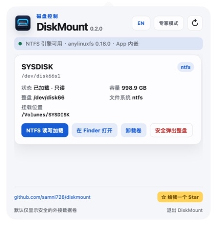

<p align="center">
  
</p>

<p align="center">
  macOS 菜单栏外接磁盘管理工具 · 安全加载、NTFS 读写与安全弹出
</p>

<p align="center">
  <a href="README.md">English</a> · <strong>简体中文</strong>
</p>

<p align="center">
  <a href="https://github.com/samni728/diskmount/releases/latest">下载最新版</a> ·
  <a href="https://github.com/samni728/diskmount/stargazers">给项目一个 Star</a>
</p>

# DiskMount

当前版本：**0.2.0**

DiskMount 会识别 U 盘和移动硬盘，并在紧凑的菜单栏面板中提供加载、卸载、Finder 打开和安全弹出操作。NTFS 卷通过 App 内嵌的 `anylinuxfs` 运行时以读写方式重新加载，不会改变原有文件系统格式。

> [!IMPORTANT]
> DiskMount 不会格式化、抹掉、重新分区或转换磁盘格式。“NTFS 读写加载”只改变当前挂载方式。



## 主要功能

- 原生 macOS 菜单栏 AppKit 生命周期与 WebKit 控制面板；
- 外接卷加载、卸载或改名时自动刷新；
- 支持英文和简体中文，语言选择会保存；
- 显示卷名、设备标识、所属整盘、文件系统、容量、挂载点和读写状态；
- FAT、exFAT 和 APFS 数据卷的普通加载与卸载；
- 通过内嵌 `anylinuxfs 0.18.0` 进行 NTFS 读写加载；
- 在 Finder 打开已加载卷，并安全弹出外接整盘；
- 固定头部与底部，仅中间磁盘列表滚动；
- App 内置项目地址和 Star 按钮。

## 默认安全模式与专家模式

默认安全模式会隐藏当前 macOS 启动磁盘，以及 EFI、Recovery、Preboot、VM、Update 等技术分区。

专家模式会显示高级卷，但不会自动解锁。用户必须对每一个卷再次阅读警告并确认。通过二次确认后，该卷可在当前 App 会话中尝试加载、在 Finder 打开和卸载。

安全边界会在 Swift 业务层强制执行，不只是 WebUI 文案：

- 关闭专家模式或退出 App 后，会话授权立即失效；
- 不允许通过专家模式弹出受保护的整块磁盘；
- 不会绕过 SIP 或 macOS 安全策略；
- 不会强制将已封存的 macOS 系统卷变为可写；
- 不存在格式转换、抹盘或重新分区功能。


## 0.2.0 的 NTFS 授权修复

旧版通过 macOS 管理员授权窗口把 `anylinuxfs` 直接作为 root 进程启动。这种方式不像 `sudo` 那样提供 `SUDO_UID` 和 `SUDO_GID`，因此 anylinuxfs 无法判断真实桌面用户并主动拒绝挂载。

0.2.0 保留 macOS 系统管理员授权窗口，同时传入 anylinuxfs 所需的真实用户身份，等价于终端中的 `sudo anylinuxfs ...` 权限模型。DiskMount 不会读取或保存管理员密码。

## 系统要求

- Apple Silicon：M1、M2、M3、M4、M5 或后续芯片；
- macOS 26 或更高版本；
- 首次初始化 Alpine microVM 根文件系统时需要网络；
- 挂载需要更高权限时，需通过 macOS 管理员授权。

0.2.0 不支持 Intel/x86 Mac，因为上游 `anylinuxfs/libkrun` 运行时目前主要支持 Apple Silicon。

## 安装

1. 从 [Releases](https://github.com/samni728/diskmount/releases) 下载 `DiskMount-0.2.0-macOS26.dmg`；
2. 打开 DMG，将 `DiskMount.app` 拖入“应用程序”；
3. 从“应用程序”启动 DiskMount；
4. 首次显示面板后，App 会继续常驻顶部菜单栏。

DMG 内嵌 ARM64 的 anylinuxfs、Linux kernel、VM helpers、modules 和 `libblkid`。最终用户不需要安装 Homebrew、Xcode、XcodeGen 或独立的 anylinuxfs。

当前发布包使用 Apple Development 证书，适合项目测试。若需面向所有用户无警告公开分发，仍需要 Developer ID Application 证书、Apple 公证和 stapling。

## 构建与测试

```bash
cd DiskMount
xcodegen generate
xcodebuild \
  -project DiskMount.xcodeproj \
  -scheme DiskMount \
  -configuration Debug \
  -derivedDataPath build/TestDerived \
  test
```

构建本机签名 DMG：

```bash
cd DiskMount
./scripts/build_dmg.sh
```

## 自动 Release

`.github/workflows/release.yml` 会在每次推送 `v*` 版本标签时，使用 GitHub Apple Silicon `macos-26` runner 自动：

1. 校验标签与 `VERSION` 是否一致；
2. 构建自包含 DMG；
3. 生成 SHA-256 校验文件；
4. 创建带自动更新说明的 GitHub Release。

```bash
# 先更新 VERSION 和更新说明
git tag -a v0.2.1 -m "DiskMount 0.2.1"
git push origin main
git push origin v0.2.1
```

如未配置 Developer ID 签名和公证 Secrets，自动产物使用 ad-hoc 签名。详细维护清单见 [RELEASING.md](RELEASING.md)。

## 开源项目致谢

DiskMount 的 NTFS 读写能力建立在 [nohajc/anylinuxfs](https://github.com/nohajc/anylinuxfs) 之上。anylinuxfs 结合 Linux 原生文件系统驱动、[libkrun](https://github.com/containers/libkrun) microVM 和 NFS。感谢 anylinuxfs 作者，以及 libkrun、libkrunfw、vmnet-helper、gvproxy、docker-nfs-server 和 util-linux 贡献者。

DiskMount 通过独立进程调用未修改的 anylinuxfs。发布包保留上游许可证、README、SBOM 和 util-linux 许可文件。版本、源码地址、校验值和许可详情见 [THIRD_PARTY_NOTICES.md](DiskMount/Resources/THIRD_PARTY_NOTICES.md)。

DiskMount 不是 anylinuxfs 官方 GUI，也不代表上游项目对本项目提供背书。

## 已知限制

- anylinuxfs 会将卷作为本机 NFS 网络卷暴露给 macOS；
- Microsoft Word 可能无法直接编辑这类网络卷上的文件；
- 默认 ntfs-3g 驱动在长时间大量传输时可能出现可重试 I/O 错误；
- 首次 microVM 初始化需要网络；
- 文件正在写入时不应卸载或拔出设备。

完整版本历史见 [CHANGELOG.md](CHANGELOG.md)。
