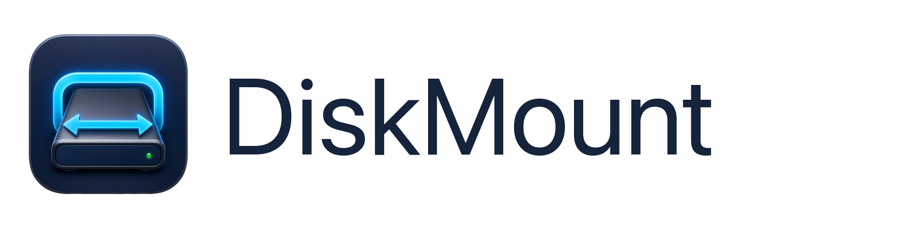
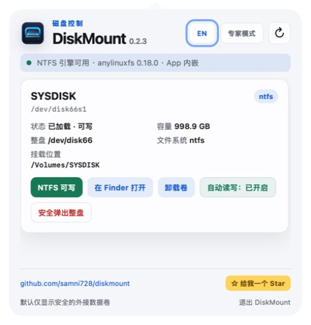
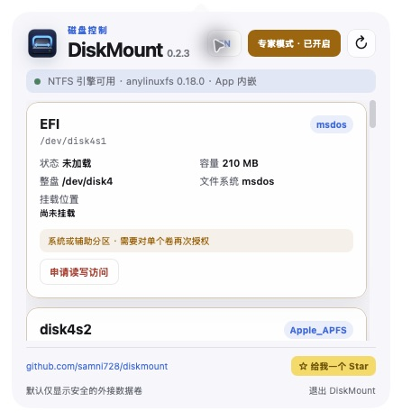
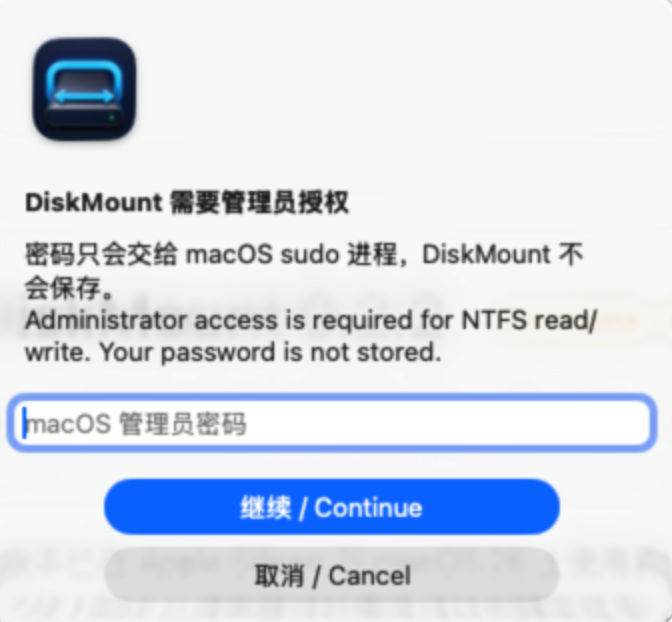

<p align="center">
  
</p>

<p align="center">
  macOS 菜单栏外接磁盘管理工具 · 安全加载、NTFS 读写与安全弹出
</p>

<p align="center">
  <a href="README.md">English</a> · <strong>简体中文</strong>
</p>

<p align="center">
  <a href="https://github.com/samni728/diskmount/releases/latest">下载最新版</a> ·
  <a href="https://github.com/samni728/diskmount/stargazers">给项目一个 Star</a>
</p>

<p align="center">
  支持项目持续开发 —
  <a href="https://ko-fi.com/samni728">
    
  </a>
  <sub>⌘-点击可在新标签打开并保留此页面</sub>
</p>

# DiskMount

当前版本：**0.2.9**

DiskMount 会识别 U 盘和移动硬盘，并在紧凑的菜单栏面板中提供加载、Finder 打开和安全弹出操作。NTFS 卷通过 App 内嵌的 `anylinuxfs` 运行时以读写方式重新加载，不会改变原有文件系统格式。普通模式只提供一个清晰的“安全弹出”操作；单独卸载卷仅保留给专家模式中的高级卷。

> [!IMPORTANT]
> DiskMount 不会格式化、抹掉、重新分区或转换磁盘格式。“NTFS 读写加载”只改变当前挂载方式。

> [!WARNING]
> **启用 NTFS 读写前需要完成以下授权：**
> 1. DiskMount 请求管理员授权时，需要输入管理员密码。该授权仅用于 NTFS 加载、停止磁盘服务、安全弹出和失败恢复；密码不会被保存、记录或上传。
> 2. 前往 **系统设置 → 隐私与安全性 → 完全磁盘访问权限**，为 **DiskMount** 开启权限。
> 3. 如果 macOS 显示该选项，还需前往 **系统设置 → 隐私与安全性 → 文件与文件夹 → DiskMount → 可移动卷** 开启权限。
> 4. 修改上述任一权限后，请完全退出并重新打开 DiskMount。



## 主要功能

- 原生 macOS 菜单栏 AppKit 生命周期与 WebKit 控制面板；
- 外接卷加载、卸载或改名时自动刷新；
- 支持英文和简体中文，语言选择会保存；
- 显示卷名、设备标识、所属整盘、文件系统、容量、挂载点和读写状态；
- FAT、exFAT 和 APFS 数据卷的普通加载；
- 通过内嵌 `anylinuxfs 0.18.0` 进行 NTFS 读写加载；
- 中文及其他非 ASCII NTFS 卷名会自动使用安全的纯 ASCII NFS 目标路径，同时 DiskMount 界面继续显示原始卷名；
- 只有检测到该设备对应的真实可写 NFS 挂载后才报告成功；如果挂载不存在，会恢复 macOS 原生 NTFS 只读挂载并显示错误；
- 按磁盘记住“自动读写”设置，App 运行期间再次插入已记住的 NTFS 磁盘时自动尝试读写加载；
- 在 Finder 打开已加载卷，并安全弹出外接整盘；
- 普通模式只显示一个“安全弹出”操作；单独卸载卷仅保留给专家模式中的高级卷；
- 安全弹出会先停止 anylinuxfs/NFS 服务再释放物理磁盘；磁盘仍被占用时会明确提示，等待超过 30 秒会停止操作，不再让面板无限处于处理中；
- 停止 NTFS 服务时复用当前管理员授权，在同一次有效授权会话中不再重复弹出密码框；
- 安全弹出后，只要设备仍处于同一次物理连接周期，就持续隐藏；只有真正拔出并重新插入后才恢复显示；
- App 启动和用户手动刷新时检查 GitHub 最新正式 Release；仅在有新版本时，才在当前版本号旁显示持续闪亮的小绿点，鼠标悬停可查看说明，点击后打开下载页面；
- 更新检查不会自动下载或安装软件，跳转地址仅允许本项目官方 GitHub Releases 路径；
- 固定头部与底部，仅中间磁盘列表滚动；
- App 底部提供低调的 Ko-fi、GitHub 图标链接和 Star 按钮。

## 默认安全模式与专家模式

默认安全模式会隐藏当前 macOS 启动磁盘，以及 EFI、Recovery、Preboot、VM、Update 等技术分区。

专家模式会显示高级卷，但不会自动解锁。用户必须对每一个卷再次阅读警告并确认。通过二次确认后，该卷可在当前 App 会话中尝试加载、在 Finder 打开和卸载。

安全边界会在 Swift 业务层强制执行，不只是 WebUI 文案：

- 关闭专家模式或退出 App 后，会话授权立即失效；
- 不允许通过专家模式弹出受保护的整块磁盘；
- 不会绕过 SIP 或 macOS 安全策略；
- 不会强制将已封存的 macOS 系统卷变为可写；
- 不存在格式转换、抹盘或重新分区功能。



## 权限与授权说明

DiskMount 可能需要三类相互独立的 macOS 权限。它们均由 macOS 管理，用途并不相同。

### 管理员授权

NTFS 读写加载需要管理员权限，因为内嵌引擎必须访问外接磁盘的块设备，并替换 macOS 默认的 NTFS 只读挂载。

<p align="center">
  
</p>

出现此提示时，请输入 macOS 管理员账户的密码并点击 **继续**。密码只用于当前提权操作：

- 密码在 macOS 原生安全输入框中输入；
- DiskMount 只通过标准输入把密码直接交给 `/usr/bin/sudo`；
- 提交后会立即清空输入框；
- 密码不会写入磁盘、偏好设置、日志、统计分析或任何网络服务；
- 提权操作仅用于内嵌 NTFS 加载、为安全弹出停止其磁盘服务，以及失败后恢复 macOS 普通只读挂载。

DiskMount 运行期间会维持 macOS 的 `sudo` 授权时间戳。这样，已经授权并被记住的磁盘再次插入时可以自动读写加载，而不需要保存密码。退出 DiskMount 后不会继续维持该授权；重新打开 App 后，macOS 可能再次要求输入管理员密码。

### 完全磁盘访问权限与可移动卷权限

即使管理员密码已通过，macOS 仍可能单独阻止原始外接磁盘访问。遇到这种情况，请检查：

1. **系统设置 → 隐私与安全性 → 完全磁盘访问权限 → DiskMount**；
2. **系统设置 → 隐私与安全性 → 文件与文件夹 → DiskMount → 可移动卷**（系统显示此开关时）；
3. 修改任一权限后，完全退出并重新打开 DiskMount。

“完全磁盘访问权限”是 macOS 管理的一项范围较广的权限。DiskMount 仅将磁盘访问用于识别外接卷、加载或卸载用户选择的设备、提供 NTFS 读写，以及失败后恢复安全的只读挂载。App 不会格式化磁盘，也不会上传磁盘内容。

专家模式中的二次确认只是 DiskMount 内部的额外安全检查，不能替代管理员授权或 macOS 隐私权限。

## 系统要求

- Apple Silicon：M1、M2、M3、M4、M5 或后续芯片；
- macOS 26 或更高版本；
- 首次初始化 Alpine microVM 根文件系统时需要网络；
- 挂载需要更高权限时，需通过 macOS 管理员授权；
- 第一次进行 NTFS 原始磁盘访问时，需允许访问可移动卷。

0.2.9 不支持 Intel/x86 Mac，因为上游 `anylinuxfs/libkrun` 运行时目前主要支持 Apple Silicon。

## 安装

1. 从 [Releases](https://github.com/samni728/diskmount/releases) 下载 `DiskMount-0.2.9-macOS26.dmg`；
2. 打开 DMG，将 `DiskMount.app` 拖入“应用程序”；
3. 从“应用程序”启动 DiskMount；
4. 首次显示面板后，App 会继续常驻顶部菜单栏。

### Gatekeeper 与第三方 App 提示

0.2.9 安装包使用开发者本人的 Apple Development 证书签名，但尚未通过 Apple 公证。其他 Mac 从互联网下载 DMG 后，第一次启动时可能会被系统阻止。

如果 macOS 阻止 DiskMount，请先尝试打开一次，然后前往 **系统设置 → 隐私与安全性 → 安全性 → 仍要打开**，输入当前 Mac 的登录密码并确认 **打开**。请使用这种单 App 放行方式，不要永久关闭 Gatekeeper。公司或学校管理的 Mac 可能还需要 IT 管理员批准。

完整流程请阅读[中文安装与授权指南](INSTALLATION.zh-CN.md)或[英文指南](INSTALLATION.md)。Apple 官方也提供了[安全地打开 Mac App](https://support.apple.com/en-ie/102445)说明。

### App 启动后的磁盘权限

第一次进行 NTFS 读写加载时，可能需要管理员密码、完全磁盘访问权限和可移动卷权限。这些授权相互独立。DiskMount 会说明每项权限的用途，并且不会持久化管理员密码。

DMG 内嵌 ARM64 的 anylinuxfs、Linux kernel、VM helpers、modules 和 `libblkid`。最终用户不需要安装 Homebrew、Xcode、XcodeGen 或独立的 anylinuxfs。

当前发布包使用 Apple Development 证书，适合项目测试。若需面向所有用户无警告公开分发，仍需要 Developer ID Application 证书、Apple 公证和 stapling。上面的 Gatekeeper 单 App 放行不会自动授予磁盘权限，用户仍需另行开启 macOS 隐私权限。

## 构建与测试

```bash
cd DiskMount
xcodegen generate
xcodebuild \
  -project DiskMount.xcodeproj \
  -scheme DiskMount \
  -configuration Debug \
  -derivedDataPath build/TestDerived \
  test
```

构建本机签名 DMG：

```bash
cd DiskMount
./scripts/build_dmg.sh
```

## 自动 Release

`.github/workflows/release.yml` 会在每次推送 `v*` 版本标签时，使用 GitHub Apple Silicon `macos-26` runner 自动：

1. 校验标签与 `VERSION` 是否一致；
2. 构建自包含 DMG；
3. 生成 SHA-256 校验文件；
4. 创建带自动更新说明的 GitHub Release。

```bash
# 先更新 VERSION 和更新说明
git tag -a v0.2.9 -m "DiskMount 0.2.9"
git push origin main
git push origin v0.2.9
```

如未配置 Developer ID 签名和公证 Secrets，自动产物使用 ad-hoc 签名。详细维护清单见 [RELEASING.md](RELEASING.md)。

## 开源项目致谢

DiskMount 的 NTFS 读写能力建立在 [nohajc/anylinuxfs](https://github.com/nohajc/anylinuxfs) 之上。anylinuxfs 结合 Linux 原生文件系统驱动、[libkrun](https://github.com/containers/libkrun) microVM 和 NFS。感谢 anylinuxfs 作者，以及 libkrun、libkrunfw、vmnet-helper、gvproxy、docker-nfs-server 和 util-linux 贡献者。

DiskMount 通过独立进程调用未修改的 anylinuxfs。发布包保留上游许可证、README、SBOM 和 util-linux 许可文件。版本、源码地址、校验值和许可详情见 [THIRD_PARTY_NOTICES.md](DiskMount/Resources/THIRD_PARTY_NOTICES.md)。

DiskMount 不是 anylinuxfs 官方 GUI，也不代表上游项目对本项目提供背书。

## 已知限制

- anylinuxfs 会将卷作为本机 NFS 网络卷暴露给 macOS；
- Microsoft Word 可能无法直接编辑这类网络卷上的文件；
- 默认 ntfs-3g 驱动在长时间大量传输时可能出现可重试 I/O 错误；
- 首次 microVM 初始化需要网络；
- 文件正在写入时不应卸载或拔出设备。

完整版本历史见 [CHANGELOG.md](CHANGELOG.md)。
